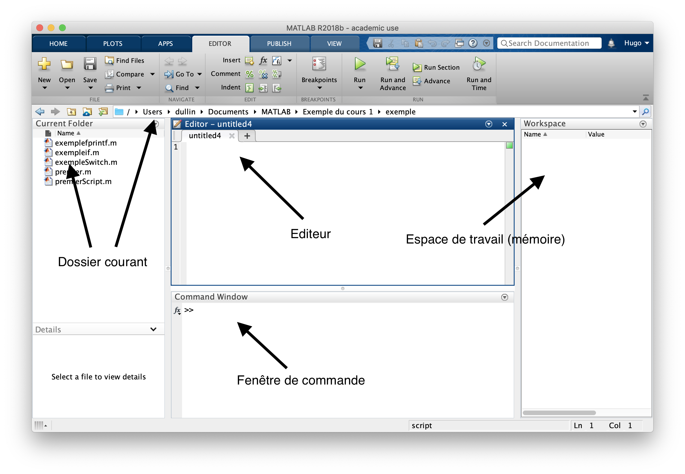

---
title: INF135 - Introduction à la programmation en génie mécanique
author: Hugo Leblanc
date: Cours 1
pandocomatic_:
  use-template: 
  - presentation
  - presentation-handout
...

# Présentation personnelle
* Hugo Leblanc;
* hugo.leblanc@etsmtl.ca;
* Baccalauréat en génie électrique de l'ÉTS en 2012;
* Programmeur depuis 1996;
* Spécialisation en systèmes embarqués.

# Plan de cours
* Pondération;
* Date de remise;
* Politique de plagiat.

# Moodle
* Centre des intéractions du cours;
* Présentation
* Notes de cours
* Exercices
* Remise de travaux pratiques;
* Accès Slack.

# Structure de travail du cours
* 1000 erreurs à faire avant la fin de la session;
* Très facile de perdre le contrôle sur la matière;
* Les travaux pratiques sont des préparations aux examens.

# Objectifs de la semaine
* Le flot et les instructions de programmation (scripts);
* Commentaires;
* Les variables et l'instruction d'assignation avec `=`;
* Les opérateurs arithmétiques et de comparaisons;
* Structure de contrôles conditionnels `if` et `switch`.

# Environnement Matlab

# Flot d'instructions
* Une instruction est une commande qui sera exécutée par MATLAB;
* Chaque instruction est **évaluée** et **exécutée** par MATLAB avant de passer à la prochaine. Les programmes sont exécutés de manière purement séquentielle;
* Pour les instructions avec des opérations complexes, une **priorité d'opération** sera suivie.

# Fonctions de base et caractères spéciaux de MATLAB
* `clc` - Vide la fenêtre de commande (Command Window);
* `clear` - Vide l'espace de travail (Workspace);
* `help` _nomFonction_ - Donne de l'aide sur la fonction donné;
* `doc` _nomFonction_ - Donne la documentation sur la fonction donné.

* Le caractère `;` est utilisé pour faire l'exécution d'une instruction silencieusement;
* Les points de suspension `...` permettent de faire un saut de ligne dans le milieu d'une instruction.

# Commentaires
* Le pourcentage `%` débute une ligne de commentaire;
* Le reste de la ligne après le `%` ne sera pas considéré par MATLAB durant l'exécution du code;
* Une ligne vide sera aussi sautée par MATLAB;
* Les commentaires sont primordiaux à la programmation;
* Les commentaires sont utilisés en en-tête de fichiers, fonctions et programmée ainsi qu’à l’intérieur d’un programme pour aider à comprendre l’intention des instructions.

# Scripts
* Un script est un amalgame d'instructions qui seront exécutées ensemble;
* Le script fait exactement la même chose qu'entrer les instructions une par une dans la fenêtre de commande;
* Un script est contenu dans un fichier avec l'extension `.m`. Le nom du fichier sera un  `identificateur`.

# Identificateurs
* Les identificateurs sont utilisés pour identifier les différents éléments que nous ajoutons à notre programme;
* Les identificateurs sont les noms que l’on donne à nos variables, scripts et fonctions;
* Les caractères permis sont :
    * Tout caractère alphanumérique;
    * Le tiret-bas `_`.
* Le premier caractère doit être alphabétique.
* Faites attention! Pour MATLAB, les majuscules et minuscules sont des caractères différents.

# Exercice 1
* Écrivez un script qui calcule un salaire hebdomadaire à partir d’un nombre d’heures travaillées et un salaire horaire. Affichez le salaire brut ainsi que le salaire net après 15% de taxes.

# Variables et instruction d'assignation
* Une variable est la combinaison d’un espace mémoire réservé, un identificateur et une valeur;
* L'assignation utilise l'égalité `=` pour lier la valeur à l'identificateur;
~~~MATLAB
nomVariable = 10
~~~
* L’assignation se fait toujours d’une **expression** à droite vers un identificateur à gauche;
* L'expression sera évaluée avant d'être assignée dans la variable;
~~~MATLAB
nomVariable = nomVariable + 5
~~~
* Le contenu d'une variable existante est écrasé lors d'une assignation.

# Constantes
* Les constantes sont une convention de programmation sous MATLAB;
* Un identificateur en majuscule indique une constante;
* La constante est une variable qui est assignée une seule fois dans notre programme;
* On utilise des constantes pour toutes entités statiques d’un programme.
~~~MATLAB
MA_CONSTANTE = 50
~~~

# Exercice 2
* Écrivez un script qui calcule un salaire hebdomadaire à partir d’un nombre d’heures travaillées et un salaire horaire. Affichez le salaire brut ainsi que le salaire net après 15% de taxes.
* Utilisez des variables pour le nombre d’heures travaillées, le salaire horaire, le salaire brut et le salaire net.

# Type de données
* Trois types de données seront rencontrés généralement durant ce cours:
    * `double` - entité numérique (ex: 3, 3.4, -45);
    * `char` - entité textuelle (ex: 'a', 'Bonjour!');
    * `logical` - valeur logique true (1) ou false (0).

# Saisie avec la fonction `input`
* Une saisie utilise la fonction `input` pour assigner l'entrée d'un utilisateur dans une variable.
~~~MATLAB
% Saisie d'un nombre
saisi = input('Texte à afficher à la saisie: ')

% Saisie d'une chaine de caractères (texte)
% Ajoute l'option 's'
saisiChaine = input('Texte à afficher: ', 's')
~~~

# Affichage avec la fonction `fprintf`
* L'affichage de texte utilise la fonction `fprintf` pour présenter une chaine de caractères dans la fenêtre de commande.
~~~MATLAB
fprintf('Texte à afficher!')
% Utilise le caractère spécial \n pour un saut de ligne
fprintf('Une ligne\net une autre')
~~~

# Exercice 3
* Écrivez un script qui calcule un salaire hebdomadaire à partir d’un nombre d’heures travaillées et un salaire horaire;
* Faites-la saisie du nombre d’heures travaillées et du salaire horaire au clavier;
* Afficher un message d’information avant d’afficher le salaire.

# Affichage d'expression avec `fprintf`
* `fprintf` a la possibilité d'afficher l'évaluation d'une expression;
~~~MATLAB
x = 3;
chaine = 'allo';
fprintf('Chiffre: %g', x)
fprintf('Chaine: %s', chaine)
fprintf('Chiffre %g et chaine %s', x, chaine)
~~~
* L'opérateur de formatage est un `%` suivi d'une lettre qui dépend de l'information à afficher:
    * %g pour des valeurs numériques;
    * %s pour des chaines de caractères.
* La fonction `disp` permet aussi de faire l'affichage d'une seule variable.

# Exercice 4
* Écrivez un script qui calcule un salaire hebdomadaire à partir d’un nombre d’heures travaillées et un salaire horaire.
* Faites-la saisie du nombre d’heures travaillées et du salaire horaire au clavier.
* Afficher un message avec le salaire net.

# Opérateurs relationnels
* Les opérateurs relationnels permettent de faire des comparaisons entre deux expressions;
* Les opérateurs donnent toujours un résultat logique (vrai ou faux);
* Les opérateurs sont :
    * `<`, `<=`, `>`, `>=`, `==` (égalité), `~=` (différent de).
* Il est à noter ici que l'opérateur d'égalité utilise `==` car l'assignation utilise déjà le simple `=`.

# Structure de contrôle conditionnel `if`
* La structure conditionnelle nous permet de prendre des décisions durant l'exécution de nos programmes;
* La décision à prendre doit être prise sur une expression logique (vrai ou faux);
* La syntaxe de base est la suivante:
~~~MATLAB
if expression logique
    instructions
end
~~~

# Options de la conditionnel `if`
* Plusieurs options sont disponibles avec le if;
~~~MATLAB
if expression logique
    instructions
elseif expression logique
    instructions
else
    instructions
end
~~~
* Seul un des blocs d’instructions (décision) du `if` est exécuté
* Le `elseif` et le `else` sont facultatifs
* Le `elseif` peut être répété à plusieurs reprises avec différentes expressions

# Exercice 5
* Écrivez un script qui calcule un salaire hebdomadaire avec la saisit du nombre d’heures travaillées et du salaire horaire.
* Considérez si l’utilisateur à fait du temps supplémentaire et ajuster son salaire en conséquence.

# Structure de contrôle conditionnel `switch`
* Le `switch` est utilisé pour prendre une décision par rapport à la valeur d'une seule variable
~~~MATLAB
switch expression
    case 5 % Valeur litérale
        instructions
    case 7
        instructions
    ...
    otherwise
        instructions
end
~~~

# Normes de programmation
* L'écriture du code est gérée par des normes de programmations;
* Ces normes sont propres au cours et doivent être respectées;
* Une approche de programmation défensive est utilisée dans les normes pour capter les erreurs avant de les commettre.
* Le document de normes est disponible sur le site de cours.
