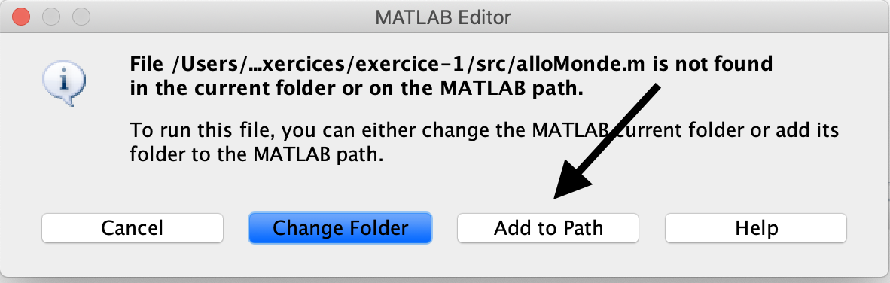
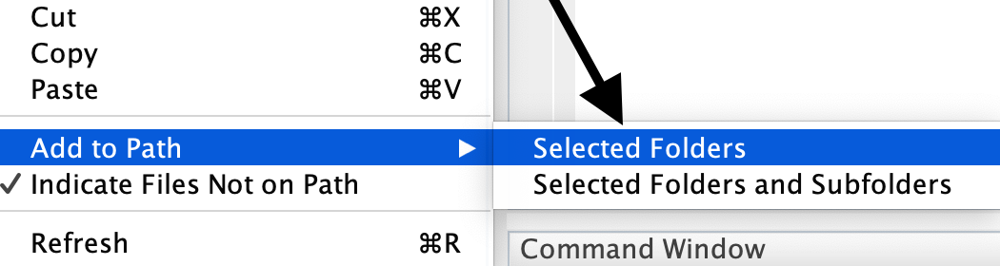

---
title: INF135 - Chemin d'accès, validation et tableaux
author: Hugo Leblanc
date: Cours 4
pandocomatic_:
  use-template: 
  - presentation
  - presentation-handout
...
# Objectifs de la semaine
* Dossier et chemin d'accès
* Validation
* Tableau d'une dimension - vecteur
    * Initialisation
    * Accès
    * Dynamisme

# Dossier et chemin d'accès
* MATLAB cherche les fonctions appellées dans nos programmes dans des emplacement par défaut;
* La liste de dossier est nommé chemin d'accès (Path ou Search Path en anglais);
* Le dossier courant et le dossier de MATLAB dans nos documents font parties du chemin d'accès par défaut;
* Il est possible de modifier la liste de dossier du chemin d'accès.

# Modification du `path`
* Il existe plusieurs méthode de modifier les dossiers dans le chemin d'accès:
    * Le premier est automatique si on utilise un fichier qui n'est pas dans le chemin d'accès. MATLAN nous donne l'option de rajouté le dossier dans le chemin d'accès; 

    {width=200px}
    * À partir du dossier courant, l'option contextuelle "Add to path" est disponible pour rajouter un dossier;

    {width=50%}
    * La dernière option est à l'intérieur de nos programmes, la fonction `addpath` nous permet de rajouter des dossier avant de le utiilsé dans un programme d'envergure.

# Dossier de tests
* Avec la modification des chemins d'accès, nous l'utiliserons pour placer les tests dans leur propres dossier;
* Si on nomme les tests avec les mot Test en suffix aux script de tests, il nous est possible de rouler tous les tests qui se trouvent dans le même dossier;
* La commande `runtests(nomDossier)` roule tout les tests et génère un rapport des tests;
* La commande `runtests` ne considère pas le dossier courant. Il faut donc ajouter notre dossier de fonction manuellement avant d'appeller `runtests`.

# Dossier de constantes
* Avec l'ajout de dossier, on peut incorporer un dossier de constantes;
* Les constantes utilisé plusieurs fois à l'intérieur d'un programme seront disponible à l'intérieur de se dossier;
* Les constantes dans un dossier sont implémentées comme une fonction qui ne reçoit rien et retourne la valeur de la constante. C'est la méthode que matlab utilise pour ses propres constantes (pi, i, etc.).

# Validation
* La validation est la vérification d'informations à l'intérieur de nos programmes;
* La validation est appliqué sur les informations venant d'une source externe;
* Habituellement en réception de paramètres d'entrés ou après une saisie avec `input`;
* Le but est la détection d'une information invalide et la génération d'une erreur avant de calculé des résultats qui seront corrompues.

# Fonctions de validation
* Quelques fonctions sont utile pour la validation:
    * `error`/`assert` - Génère une erreur avec un message. `assert` pour avoir une conditionnel intégré;
    * `isempty` - Détecte si la variable ne contient rien;
    * `is*` - Détermine si une information est d'un type précis. Le `*` est remplacé par le type. Ex: `isnumeric`, `ischar`, `islogical`;
    * Nous fournissons la fonction `assertError` pour faire des tests de validation.

# Exercice 1
* Ajouté la validation que les paramètres d'entrés soient des nombres non-vide et que ces nombre soient positifs à notre fonction de calcul d'aire d'un triangle.

# Tableau
* Les tableaux sont des collections de plusieurs éléments de même type sous un seul identificateur;
* Le tableau est construit de cases mémoire consécutives en mémoire;
* À chaque élément du tableau, on associe un indice qui permet de facilement accéder aux cases individuellement;
* Dans MATLAB, toutes les variables sont des tableaux;
* Nous regarderons pour commencer que des tableaux d'une dimensions;
* Les tableaux de valeurs numériques d'une dimensions sont aussi appellé des vecteurs.

# Tableau - Initialisation
Les fonctions suivantes permettent de créer des tableaux de taille initialle prédéfinis:

* `zeros(1, j)`/`ones(i, j)` - Initialise toutes les cases à 0/1;
* `rand(1, j)`/`randi(max, 1, j)` - Initialise de manière aléatoire entre 0 et 1/1 et un nombre entier;
* `début:saut:fin`- Contruit une énumération. Les même règle que le `for`;
* `[ liste de valeurs ]` - Construit un tableau avec les valeurs données.

# Tableau - Accès aux éléments
* L'accès aux cases du tableau se fait à travers un indice. L'indice est utilisé entre des parnethèses suivant l'identificateur du tableau;
* Cette méthode peut être utiilsé pour assigné à une case spécifique ou comme information dans une expression.

~~~MATLAB
tab = zeros(1,5)
tab(3) = 2
x = tab(3) + 5
~~~

# Exercice 2
* Écrivez un script qui crée un tableau de 5 cases initialisées à 0. Le script remplit ensuite chaque case du tableau avec une saisie de l’utilisateur. Trouvez et affichez la valeur maximale du tableau.

# Tableau - dynamisme
* Les tableaux de MATLAB sont dynamiques. Ils peuvent changer de taille au besoin;
* Dans le cas d’une assignation dans une case non existante, le tableau sera agrandi pour donner une place à la nouvelle valeur;
* La destruction d'une case est aussi possible en assignant une valeur vide avec `[ ]`;
* La taille du tableau peut être connu avec la fonction `numel`;
* Pour tester des tableaux, nous utiliserons la fonction `isequal` avec le `assert`;
* Le mot clé `end` peut être utilisé comme indice pour sélectionné la dernière case d'un tableau.

# Tableau - tests
* Les fonctions qui retournent des tableaux doivent avoir des tests qui utilise la fonction `isequal` pour faire la comparaison de tableaux.

```MATLAB
assert(isequal(mafcn(23, 545), [34 65 2]))
```


# Exercice 3
* Écrivez une fonction qui reçoit un tableau et une valeur, la fonction retourne le nombre d'occurence de la valeur dans le tableau;
* Écrivez une fonction qui reçoit un tableau de taille inconnu, un seuil minimum, un seuill maximum et un nouvelle valeur. La fonction modifie toutes les valeurs du tableau entre les deux seuil à la nouvelle valeur reçue. La fonction retourne le tableau avec les valeurs modifiées.

# Concaténation
* Les tableaux peuvent être créé à partir de d'autre tableau;
* Cette construction s'appèle la concaténation;
* Toutes les valeurs d'un tableau sont copier à son utilisation dans la construction d'un autre tableau.

```MATLAB
tab1 = [4 5 6]
tab2 = [7 8 9]
tab3 [tab1 0 tab2]
```