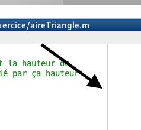
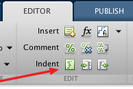
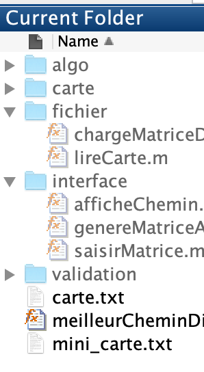
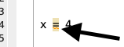
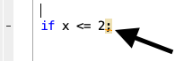

---
title: 'Normes de programmation'
author: 'Hugo Leblanc'
pandocomatic:
  pandoc:
    from: markdown
    to: pdf
    number-sections: true
  metadata:
    geometry: 'margin=1in'
...

# Introduction
Les normes de programmation sont un ensemble de règles et de conventions qui permettent d'augmenter la lisibilité du code. L'utilisation de normes permet de faciliter la correction d'un code, sa lecture par les autres programmeurs et la prévention efficace de problèmes dans nos algorithmes.

# Formatage
Le formatage du code inclut tous les éléments reliés à la disposition du code, l'utilisation d'espaces, de sauts de ligne et de l'indentation.

## Garder le code à l'intérieur de 80 colonnes
Toutes les instructions et les commentaires doivent rester à l'intérieur de 80 colonnes de caractères. MATLAB fournit un indicateur automatique (ligne grise verticale) pour facilement indiquer la colonne 75.

{width=200px}

## Couper les lignes aux endroits opportuns
Une instruction distribuée sur deux lignes doit être coupée à un endroit logique dans sa syntaxe.
Par exemple, voici une mauvaise coupure :
```MATLAB
if isempty(x) && x ... 
    > 40 && x < 100
```
La coupure devrait se trouver après une condition complète, comme ceci :
```MATLAB
if isempty(x) && x > 40 ...
    && x < 100
```
## Identer le code de 4 espaces à l'intérieur de bloc de code
Un bloc de code est le code se trouvant entre deux délimiteurs statiques : habituellement entre un mot clé et sont `end` correspondant. MATLAB offre un outil d'indentation intelligente pour faciliter l'indentation du code. Les niveaux d'indentation sont cumulatifs si plusieurs blocs de codes sont imbriqués l'un dans l'autre.
```MATLAB
if x > 20
    if y > 50
        fprintf('Ok!')
    end
end
```

Vous pouvez utiliser l'outil d'indentation automatique pour toujours avoir le bon niveau d'indentation.

{width=150px}

**Exception**: L'indentation intelligente de MATLAB n'ajoute pas de niveau d'indentation pour le bloc de code d'une fonction dans un fichier de fonctions. Il manquerait donc toujours un niveau d'indentation mais celui-ci est acceptable en MATLAB.

## Une seule instruction par ligne
Une limite d'une instruction par ligne est de mise même si plusieurs instructions peuvent partager la même ligne.
Évitez donc :
```MATLAB
if beta >= delta, alpha = beta; end
```
et remplacez par :
```MATLAB
if beta >= delta
    alpha = beta;
end
```

# Espacement
L'espacement est tout ajout d'espacement vertical (sauts de ligne), espaces à l'intérieur d'une expression et d'un appel de fonctions.

## Ajouter de l'espacement vertical pour augmenter la lisibilité
Ajoutez un saut de ligne entre les blocs contextuels du code. Chaque action que prend le code doit être séparée par une ligne et devrait habituellement être accompagnée d'un commentaire.

## Entourer les opérateurs d'espaces
Évitez d'avoir des expressions sans espaces comme :
```MATLAB
x=(z+y)*3
```
Ajoutez des espaces entre les opérateurs :
```MATLAB
x = (z + y) * 3
```

## Ajouter un espace après les virgules
Un espace doit être ajouté après l'utilisation de virgule dans l'appel et la définition de fonction :
```MATLAB
function [a] = maFcn(x, y, z)
fprintf('%g %g %g', x, y, z)
a = sum(x, y, z);
end
```

## Ne pas ajouter d'espaces autour de parenthèses
Les parenthèses ne doivent pas être entourées d'espaces avant ou après leur utilisation.

##  Ne pas ajouter d'espacement vertical inutile
L'utilisation d'espacement vertical ne doit pas dépasser plus d'une ligne. Évitez d'avoir un espacement vertical avec un changement d'indentation.

# Nommage
Le nommage inclut la création d'identificateurs pour toutes variables, fonctions, scripts et classes.

## Utiliser des noms significatifs
Toute création d'identificateur doit avoir un nom significatif.

- Utilisez des mots complets.
- L'utilisation d'abréviations est acceptée seulement si l'abréviation est de connaissance générale.

**Exception**: Si le programme a besoin d'utiliser des coordonnées géométriques ou des variables d'expressions mathématiques (par exemple x, y, z), il est acceptable de nommer seulement ces variables ainsi.

## Bonnes pratiques
Voici des bonnes pratiques pour le nommage de variables:

- Éviter des noms presque identiques
- Éviter les noms ambigus ou vagues
- Préfixe `n` pour le nombre d'éléments
- Préfixe  `this` pour représenter l'élément courant
- Préfixe `i` pour un itérateur d'éléments
- Préfixe `vec` pour un vecteur
- Préfixe `mat` pour une matrice

### camelCase pour les noms de variables
Dans les noms de variables utilisant plusieurs mots, ceux-ci sont reliés en camelCase : la première lettre de chaque nouveau mot est en majuscules et la première lettre reste en minuscule.
```MATLAB
premierPoint = 5;
nomDeVariableTresLong = 10;
```

### camelCase pour le nom des dossiers
Les noms de dossiers dans un programme suivent les même règles que les noms de variables.

{width=100px}

### Faire attention à i et j
Les variables i et j sont habituellement utilisées pour des compteurs de boucles.

**Exception**: Si le programme a besoin d'utiliser des nombres imaginaires (représenté par i et j dans MATLAB), n'utilisez pas les noms `i` et `j` pour des variables.

## Constantes
Toute donnée statique, donc qui ne change pas entre les utilisations du programme, devrait être représentée par une constante. Puisque MATLAB ne contient pas de syntaxe spécifique pour les constantes, nous utiliserons des variables ou des fonctions avec des pratiques précises pour indiquer l'utilisation de constantes. Une exception est possible pour les données statiques dont la définition est implicite. Par exemple, de diviser par 2 pour trouver la moitié ou par 100 pour obtenir un pourcentage.

### Constante en majuscules avec `_`
Les noms des constantes sont en majuscules et les mots sont séparés par un tiret-bas "`_`".
```MATLAB
MA_CONSTANTE = 5;
NOMBRE_MAX_ELEVES = 35;
```

### Constante utilisé une seule fois
Si un constante est seulement utilisé une fois, soit dans un script ou une fonction. Elle est déclaré en tant que "variable" constante au début du fichier.
```MATLAB
% Début du script.
NOMBRE_MAX_ELEVES = 35; 
% Autres instructions.
```

# Constante utilisé plus d'une fois
Les constantes qui sont réutilisées à l'intérieur d'un même programme doivent être déployées en tant que fonction de constante. Un fonction qui porte le nom de la constante, ne reçoit aucun paramètre et retourne la valeur de la constante. Il est possible de regroupé plusieurs constantes dans le même dossier de constantes pour facilité leur administration.
```MATLAB
function [const] = NOMBRE_MAX_ELEVES
const = 55;
end
```

### Utilisez un fichier de constantes pour plusieurs constantes pour usages multiples
Si le programme utilise une multitude de constantes à travers plusieurs fonctions et scripts, utilisez un script de constantes qui contiendra toutes les déclarations des constantes qui seront appelées aux endroits appropriés de votre programme.

## Structure/Classe en UpperCamelCase
Les enregistrements (struct) et les définitions de classes (classdef) sont nommées en UpperCamelCase. La première lettre et toutes les premières lettres de chaque mot sont en majuscules.
```MATLAB
Etudiant.age = 25;
compte1 = CompteBanque();
```

## Fonctions

### Noms de fonctions en camelCase
Comme les variables, les fonctions utilisent le camelCase. Chaque mot débute donc par une lettre majuscule sauf le premiet mot de la fonction. Il est à noter que les fonctions internes de MATLAB utilisent le lowercase avec toutes les lettres en minuscule, mais cette pratique n'est pas très lisible et la majorité des librairies et fonctions d'autres auteurs utilisent le camelCase.

### Préfixe is/est pour fonctions à retour booléen
Si le but de la fonction est de retourner une valeur logique par rapport à une condition donnée, le nom de la fonction devrait commencer par `is` ou `est` afin que le retour réponde directement à la question posée, par exemple `estPositif`. Cette règle est suivie par les fonctions de MATLAB.

### Une fonction qui calcule quelque chose est nommée par son retour
Si le but d'une fonction est de calculer un résultat donné, on utilise le nom du résultat comme nom de fonction.

### Une fonction qui ne retourne rien commence avec un verbe à l'infinitif
Si la fonction ne donne pas de retour, un verbe à l'infinitif est utilisé pour indiquer le comportement principal de la fonction. Par exemple, la fonction peut avoir la forme de `afficheResultat` pour indiquer que le but de la fonction est d'afficher quelque chose et non de le retourner.

# Documentation
La documentation est l'ajout de commentaires pour augmenter la lisibilité du code.

## En-tête
Chaque fichier doit contenir un en-tête qui indique le contenu du fichier. Particulièrement, les en-têtes de fonctions doivent contenir les informations suivantes:

- Description de la fonction
- Liste et description des paramètres d'entrées
- Liste et description des retours
- Example d'utilisation

Voici un exemple d'un en-tête de fonction après le prototype :
```MATLAB
function [aire] = aireTriangle(base, hauteur)
% Calcule l'aire d'un triangle à partir de la base et la hauteur du
% triangle. L'aire d'un triangle est sa base multipliée par sa hauteur
% divisé en 2.
%
% Args:
%    base (double): Taille de la base du triangle.
%    hauteur (double): Taille de la hauteur du triangle
%
% Returns:
%    double: Aire du triangle
% 
% Example:
%    >> aireTriangle(3, 4)
%       ans =
%       6
%
```

Cette forme est basé sur les [docstrings de type Google](https://github.com/google/styleguide/blob/gh-pages/pyguide.md#38-comments-and-docstrings).

## Chaque action est accompagnée d'un commentaire
Avec chaque actions du programmes, des commentaires sont ajoutés pour indiquer les actions prises par le programme. Une actions peut être une série d'instruction qui porte vers le même but.

## Les commentaires à l'indicatif présent
Pour diminuer la charge du texte dans nos programmes, les commentaires se feront à l'indicatif présent de la troisième personne du singulier en omettant la personne. 

# Programmation
Certaines règles de style s'appliquent dans les instructions. Habituellement, une dérogation à ses règles est indiquée par un avertissement (en jaune) de MATLAB.

## Ne pas utiliser `ans` comme nom de variable
La variable `ans` est la variable utilisée par défaut quand l'assignation n'est pas spécifiée, nous devons éviter de l'utiliser.

{width=100px}


## Ne pas avoir d'affichage inutile (`;` manquant)
L'utilisation du `;` avec une assignation empêche l'affichage du contenu de l'assignation durant l'exécution du programme. Contrôlez l'affichage désiré en utilisant `disp` ou `fprintf`. Il ne doit pas y avoir d'affichage superflu durant l'exécution finale du programme.

{width=100px}

## Ne pas utiliser le `;` pour rien
Évitez d'ajouter un `;` quand l'instruction n'en a pas besoin.

{width=100px}
